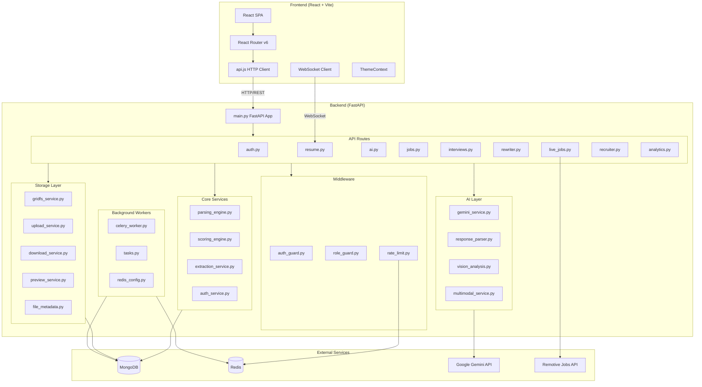
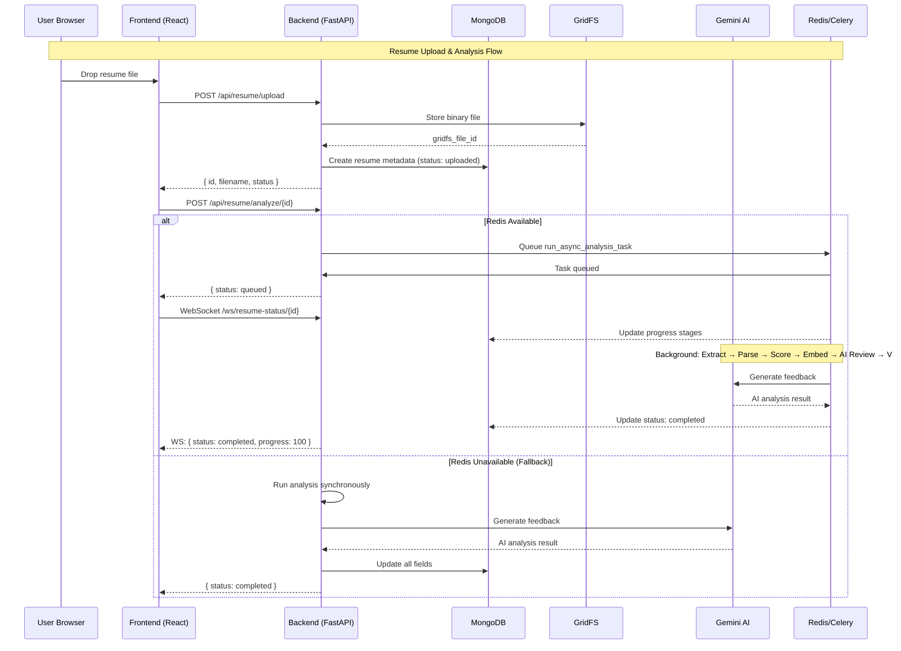
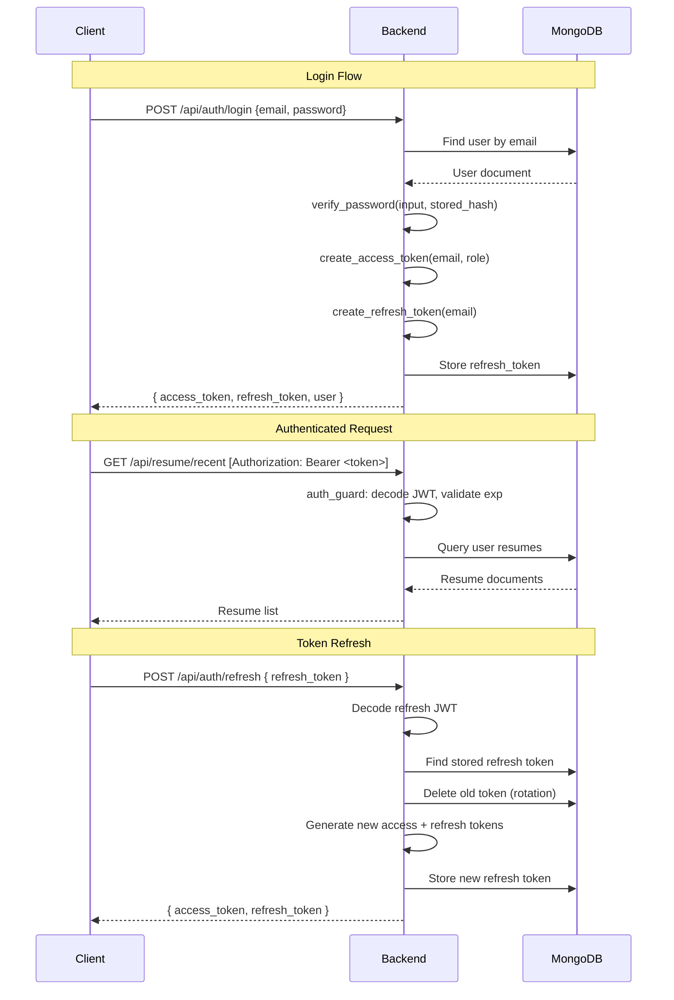

# ResumeAI — System Architecture & Stabilization Walkthrough

## System Architecture

---

## Data Flow

---

## API Endpoint Map

### Authentication (`/api/auth`)
| Method | Endpoint | Auth | Description |
|--------|----------|------|-------------|
| POST | `/signup` | ✗ | Create new user account |
| POST | `/login` | ✗ | Authenticate and get JWT tokens |
| PUT | `/change-password` | ✓ | Change password (requires current) |
| POST | `/refresh` | ✗ | Rotate refresh token |
| POST | `/forgot-password` | ✗ | Request password reset OTP |
| POST | `/reset-password` | ✗ | Reset password with OTP |
| POST | `/request-email-verification` | ✗ | Request email verification OTP |
| POST | `/verify-email` | ✗ | Verify email with OTP |

### Resume (`/api/resume`)
| Method | Endpoint | Auth | Description |
|--------|----------|------|-------------|
| POST | `/upload` | ✓ | Upload resume (GridFS + parse + score) |
| POST | `/upload-only` | ✓ | Upload without processing |
| POST | `/analyze/{id}` | ✓ | Trigger async analysis |
| GET | `/recent` | ✓ | List user's resumes |
| GET | `/detail/{id}` | ✓ | Get full resume data |
| GET | `/preview/{id}` | ✓ | Get PDF preview URL |
| GET | `/download/{id}` | ✓ | Download original file |
| DELETE | `/delete/{id}` | ✓ | Delete resume |
| WS | `/ws/resume-status/{id}` | ✗ | Real-time analysis progress |

### AI (`/api/ai`)
| Method | Endpoint | Auth | Description |
|--------|----------|------|-------------|
| POST | `/feedback` | ✓ | Generate AI recruiter feedback |
| GET | `/feedback/{id}` | ✓ | Get stored feedback |

### Jobs (`/api/jobs`)
| Method | Endpoint | Auth | Description |
|--------|----------|------|-------------|
| POST | `/match` | ✓ | Run AI job matching |
| GET | `/matches/{id}` | ✓ | Get stored matches |
| POST | `/match-custom-jd` | ✓ | Match against custom JD |
| POST | `/roadmap` | ✓ | Generate career roadmap |

### Interview Prep (`/api/interviews`)
| Method | Endpoint | Auth | Description |
|--------|----------|------|-------------|
| POST | `/generate` | ✓ | Generate interview questions |
| POST | `/evaluate` | ✓ | Evaluate mock interview answers |

### Resume Rewriter (`/api/rewriter`)
| Method | Endpoint | Auth | Description |
|--------|----------|------|-------------|
| POST | `/rewrite` | ✓ | AI-rewrite resume section |

### Live Jobs (`/api/live-jobs`)
| Method | Endpoint | Auth | Description |
|--------|----------|------|-------------|
| GET | `/recommendations` | ✓ | Skill-matched remote jobs |

### Recruiter (`/api/recruiter`)
| Method | Endpoint | Auth | Role |
|--------|----------|------|------|
| GET | `/candidates` | ✓ | recruiter/admin |
| POST | `/shortlist/add` | ✓ | recruiter/admin |
| GET | `/shortlist` | ✓ | recruiter/admin |
| POST | `/jobs` | ✓ | recruiter/admin |
| GET | `/jobs` | ✓ | recruiter/admin |
| GET | `/analytics` | ✓ | recruiter/admin |

---

## Authentication Flow

---

## Stabilization Changes Made

### Backend Fixes Applied

| # | File | Fix | Category |
|---|------|-----|----------|
| 1 | [mongodb.py](file:///c:/Users/Lenovo/OneDrive%20-%20Shiv%20Nadar%20Institution%20of%20Eminence/Documents/saketh/shiv%20nadar%20university/Resume%20Analyser/backend/database/mongodb.py) | Added architecture documentation about sync pymongo usage | Architecture |
| 2 | [main.py](file:///c:/Users/Lenovo/OneDrive%20-%20Shiv%20Nadar%20Institution%20of%20Eminence/Documents/saketh/shiv%20nadar%20university/Resume%20Analyser/backend/main.py) | Suppressed google.generativeai FutureWarning | Deprecation |
| 3 | [vision_analysis.py](file:///c:/Users/Lenovo/OneDrive%20-%20Shiv%20Nadar%20Institution%20of%20Eminence/Documents/saketh/shiv%20nadar%20university/Resume%20Analyser/backend/multimodal/vision_analysis.py) | Suppressed FutureWarning at import-time | Deprecation |
| 4 | [interviews.py](file:///c:/Users/Lenovo/OneDrive%20-%20Shiv%20Nadar%20Institution%20of%20Eminence/Documents/saketh/shiv%20nadar%20university/Resume%20Analyser/backend/routes/interviews.py) | `get_event_loop()` → `get_running_loop()` (×2) | Deprecation |
| 5 | [rewriter.py](file:///c:/Users/Lenovo/OneDrive%20-%20Shiv%20Nadar%20Institution%20of%20Eminence/Documents/saketh/shiv%20nadar%20university/Resume%20Analyser/backend/routes/rewriter.py) | `get_event_loop()` → `get_running_loop()` | Deprecation |
| 6 | [live_jobs.py](file:///c:/Users/Lenovo/OneDrive%20-%20Shiv%20Nadar%20Institution%20of%20Eminence/Documents/saketh/shiv%20nadar%20university/Resume%20Analyser/backend/routes/live_jobs.py) | Fixed bare `except:` → `except Exception:` | Code Quality |
| 7 | [live_jobs.py](file:///c:/Users/Lenovo/OneDrive%20-%20Shiv%20Nadar%20Institution%20of%20Eminence/Documents/saketh/shiv%20nadar%20university/Resume%20Analyser/backend/routes/live_jobs.py) | Fixed sort field `date` → `upload_date` | Data Bug |
| 8 | [auth.py](file:///c:/Users/Lenovo/OneDrive%20-%20Shiv%20Nadar%20Institution%20of%20Eminence/Documents/saketh/shiv%20nadar%20university/Resume%20Analyser/backend/routes/auth.py) | `print()` → `logger.info()` for OTP codes | Security |
| 9 | [auth.py](file:///c:/Users/Lenovo/OneDrive%20-%20Shiv%20Nadar%20Institution%20of%20Eminence/Documents/saketh/shiv%20nadar%20university/Resume%20Analyser/backend/routes/auth.py) | Added 10-minute OTP expiry validation | Security |

### Frontend Fixes Applied

| # | File | Fix | Category |
|---|------|-----|----------|
| 10 | [api.js](file:///c:/Users/Lenovo/OneDrive%20-%20Shiv%20Nadar%20Institution%20of%20Eminence/Documents/saketh/shiv%20nadar%20university/Resume%20Analyser/frontend/src/services/api.js) | Downgraded 404 error logs to `console.info` | DX |
| 11 | [App.jsx](file:///c:/Users/Lenovo/OneDrive%20-%20Shiv%20Nadar%20Institution%20of%20Eminence/Documents/saketh/shiv%20nadar%20university/Resume%20Analyser/frontend/src/App.jsx) | Added `React.lazy()` code-splitting for 8 pages | Performance |
| 12 | Pages (`ResumeRewriter.jsx`, `JobMatching.jsx`, `InterviewPrep.jsx`, `LiveJobs.jsx`, `Profile.jsx`) | Propagated `getRecentUploads` error and showed `useToast` error banners | Error Handling |

### Test Cleanup

| # | File | Fix | Category |
|---|------|-----|----------|
| 13 | [test_enterprise.py](file:///c:/Users/Lenovo/OneDrive%20-%20Shiv%20Nadar%20Institution%20of%20Eminence/Documents/saketh/shiv%20nadar%20university/Resume%20Analyser/tests/test_enterprise.py) | Removed duplicate Mongo cleanup boilerplate | Maintenance |
| 14 | [test_multimodal_rag.py](file:///c:/Users/Lenovo/OneDrive%20-%20Shiv%20Nadar%20Institution%20of%20Eminence/Documents/saketh/shiv%20nadar%20university/Resume%20Analyser/tests/test_multimodal_rag.py) | Removed duplicate Mongo cleanup boilerplate | Maintenance |

---

## Verification Results

| Check | Result |
|-------|--------|
| Unit Tests (34/34) | ✅ All pass |
| Backend Import Chain | ✅ Clean (no warnings) |
| Frontend Production Build | ✅ Succeeds |
| Bundle Size Reduction | ✅ 999KB → 807KB core (-19%), pages split into separate chunks |

---

## Technical Debt (Documented)

| Item | Priority | Effort |
|------|----------|--------|
| Migrate all sync PyMongo to async Motor | High | Large (~15 files) |
| Migrate `google.generativeai` → `google.genai` | Medium | Medium (~5 files, API surface differs) |
| Add end-to-end integration tests | Medium | Medium |
| Add API rate limit tests | Low | Small |
